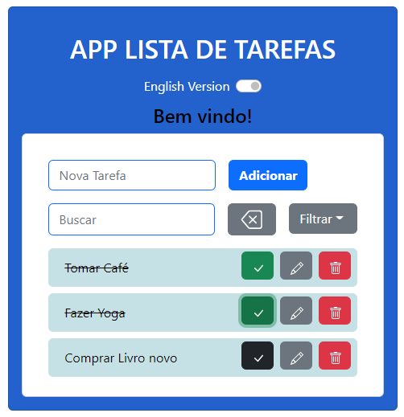
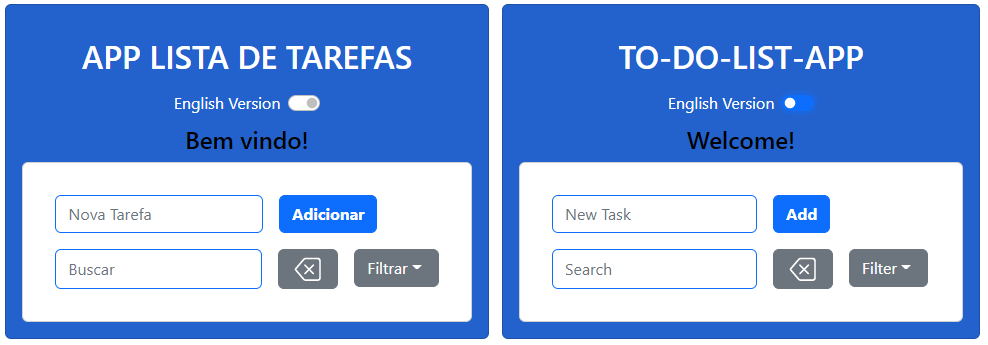
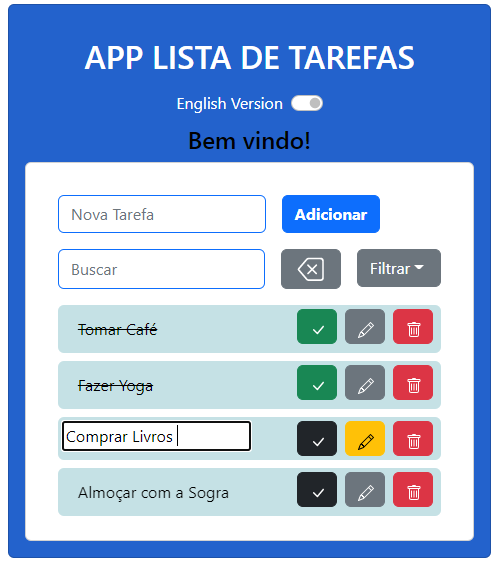
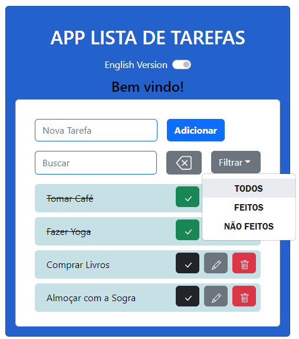
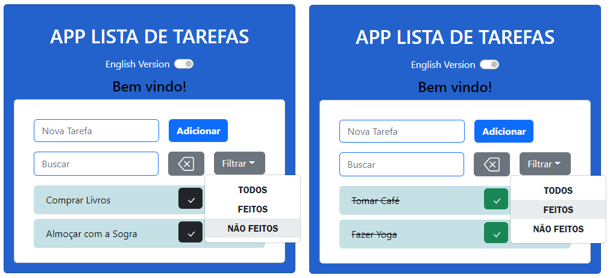
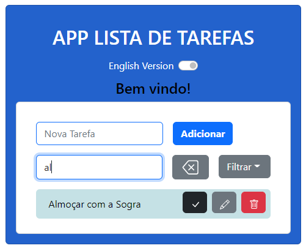
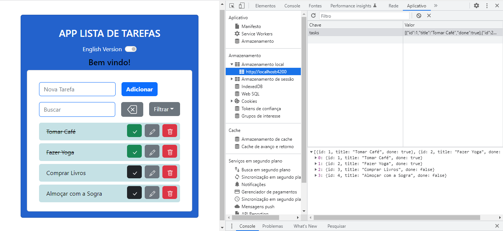

# To-Do-List / Lista de Tarefas

## Deploy do projeto:

<https://andy-to-do-list.netlify.app>

## Sobre o Projeto:

> Este projeto feito em Angular é uma lista de tarefas responsiva em que o usuário pode adicionar itens, excluir, editar e marcar como feito. Os dados ficam armazenados, mesmo que o Sistema Operacional seja reiniciado.

## English Version:

> Existe um interruptor na tela que modifica para a versão em inglês, trocando os textos para esta língua.

## Funções:

> O usuário pode **adicionar**, **deletar**, **marcar como feito** e **editar tarefas**. Para isto, basta utilizar os botões em tela respectivos,
os textos e imagens são intuitivos. A tecla *enter* pode ser usada para adicionar uma tarefa e deve ser usada para confimar a edição final ao editar.
> Tarefas maracadas como feitas ficam com o texto riscado e seu botão de marcação muda da cor preta para a verde, clicando novamente nele, a tarefa é desmarcada. O botão de Edição fica amarelo quando a edição
da tarefa está habilitada.

## Filtros

> O botão de filtro ajuda a mostrar apenas as tarefas feitas, não feitas ou voltar a exibir todas.

## Busca

> A entrada de busca ajuda a filtrar as tarefas que tem as letras escritas pelo usuário, fazendo a filtragem em tempo real.

## Armazenamento de Dados

> As tarefas adicionadas, excluídas, marcadas e editadas ficam armazenadas no Local Storage, possibilitando que o usúario sempre as encontre
novamente ao entrar no APP de forma persistente.

## Tecnologias_usadas_no_desenvolvimento

* **JavaScript** - Linguagem de programação usada na criação do projeto
* **HTML5** - Linguagem de marcação de texto
* **CSS** - Estilização da Ferramenta
* **Angular** - Framework de desenvolvimento Web Front-end
* **Bootstrap** - Framework de desenvolvimento Web Front-end

## Recursos

- [x] Sistema com os componentes em Angular
- [x] Layout com Bootstrap
- [x] Inputs e Buttons
- [x] Adição e remoção de Tarefas
- [x] Marcação e Edição de Tarefas
- [x] Filtragem de Tarefas
- [x] Busca de tarefas
- [x] Armazenamento dos Dados
- [x] Versão em Inglês
- [x] Responsividade
- [ ] Debbuging
- [ ] Usar uma Database com backend
- [ ] DB SQL
- [ ] Login de acesso
- [ ] Autenticação de Usuários JWT

